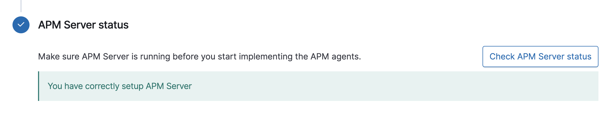

# observability-demo

An example of observability building for sjtu se-2320.

## Observability

* Logs
* Metrics
* Traces(APM)

## Tools

* Docker
* Springboot
* Springboot-actuator
* Prometheus
* Grafana
* Elasticsearch
* Logstash
* Kibana
* Elasticapm

## Operating environment

Just make sure you have the latest version of ***Docker*** installed on your machine.

## Implement the installation
First, make sure the current path of the terminal is under this folder.
### Packaging the backend

Package the springboot project, for example:

```
./mvnw clean package -Dmaven.test.skip=true
```

Build the image, for example:

```
docker build . -t 2022sjtuse-2320/demo:v1
```

### Docker-compose

All file paths use relative paths, so please check the current folder path before using.

Use the following command to start:

```
docker-compose up -d
```

> `docker ps -a` will list all containers whatever the status are.

If you want to load the data, go into the database container:

```
docker exec -it database-mysql bash
```

Login the database by `mysql -u root -p` and then load the data:

```
load data infile '/var/lib/mysql-files/movies.csv'
into table movie
fields terminated by ',' optionally enclosed by '"' escaped by '"'
lines terminated by '\r\n';
```

After starting these containers, you may need to configure or start some services for demonstration purposes. So check out what's next.

### Prometheus and Grafana

First go to the homepage of grafana, Type in the browser: `http://localhost:3000`. The default username and password are `admin`.

After logging in, find "Data Source" in the "Settings" on the left to add the Prometheus data source.


Fill in `http://prometheus:9090` at "URL", and click "Save & test" at the bottom.


Then click "Import" at "Dashboard" on the left to create a Dashboard template.


Fill in `4701` as shown in the figure, and click the "Load" button.


Click on the Dashboard on the left to view the results.


### ELK

First go to Kibana's homepage `http://localhost:5601`, and click the "Discover" button on the left.


Fill in `*` at "Index pattern", and click the "Next" button.


Select `@timestamp` for "Filter", and click the "Create index pattern" button.


Now you can click "Discover" on the left to view all log information.


There are also many visualizations and dashboards in Kibana, and you can learn and implement them yourself if you are interested.

### Elastic APM

First go to Kibana's homepage `http://localhost:5601`, and click "Add APM" button.


A deployment document will pop up here. But I have everything in the documentation ready, so you just need to click the two test buttons to confirm that the "APM server" and "APM agent" are available.




Finally, click the "Launch APM" button.


## At Last

This project is just a demonstration of observability construction, which is convenient for students to understand how to build such a complete system through Docker. If you have any questions please contact me. Also, if you have any code issues, please raise an Issue. If you want to participate in this project, you can contact me and submit a PR.
